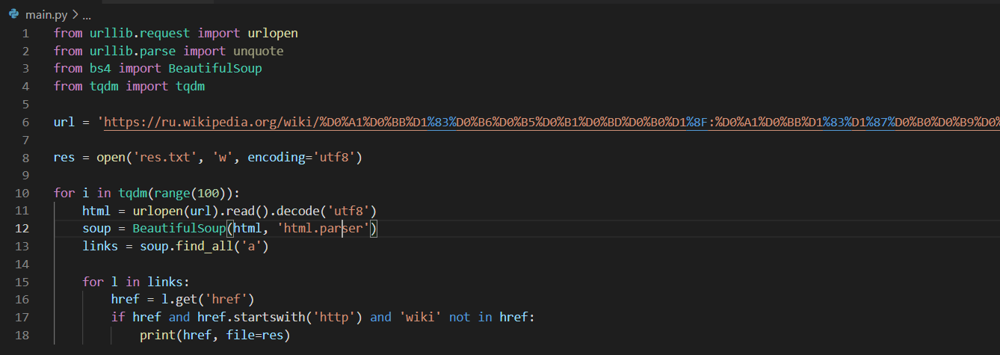

# task10
1) Сохраняем ссылки в файл
    Код:
    
    
    Консоль:
    
    
    Файл res.txt:
    
    
2) Запускаем синхронную проверку ссылок и замеряем время
    
    
    Время работы:
    
    
3) Запускаем в 5 потоков
   
   
   Время:
   
   
4) Запускаем в 10 потоков:
   
   
   Время:
   
   
5) Запускаем в 100 потоков:
   
   
   Вывод:
   Таким образом, время работы уменьшается пропорционально увеличению числа потоков, загруженность ЦП увеличивается пропорционально увеличению числа потоков.
   
CPU-bound. Генерируем монетки. 
1) Запуск генерации монет в одном процессе:
    
    
   Время:
   
   
2) Запускаем код в 2 процесса:
   
   
   Время на 2 процесса:
   
   
3) Время на 5 процессов:
   
   
4) Время на 10 процессов:
   
   
5) Время на 100 процессов:
   
   
На моем компьютере 6 ядер, значит нет смысла запускать больше 6 процессов, это видно при измерении времени.
